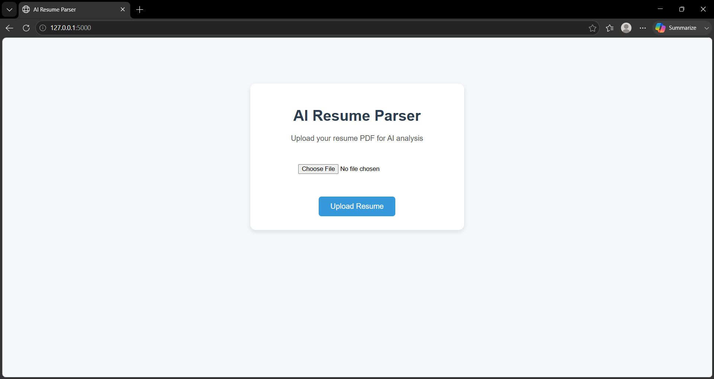
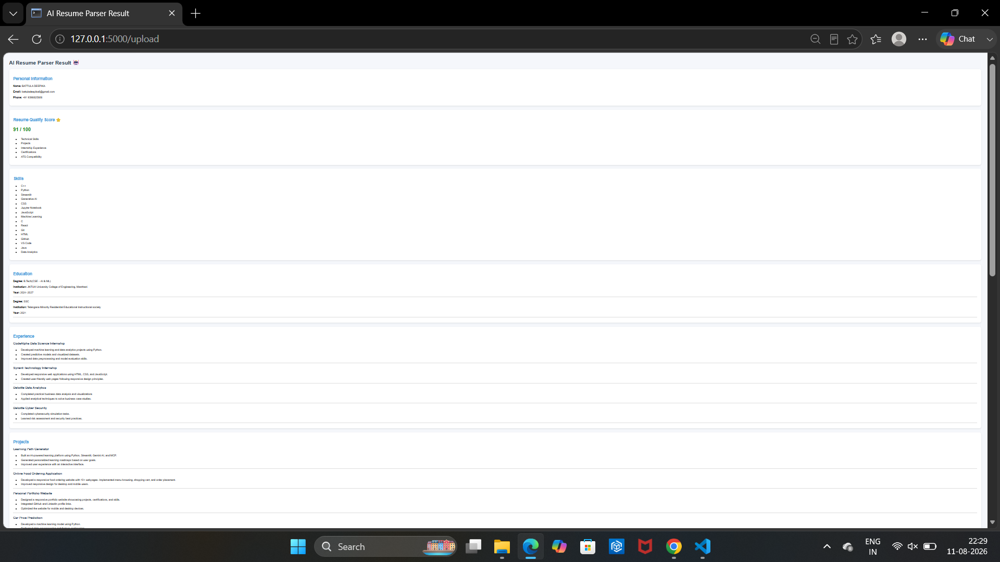

# resumeparser
# AI Resume Parser & ATS Analyzer

An AI-assisted resume processing application built with **Python** and **Flask**.  
The project extracts useful information from resumes, analyzes resume content, calculates an ATS-style score, compares resumes with job descriptions, and provides interview-related insights.

## Features

- 📄 **Resume Text Extraction**
  - Extracts text from PDF resumes.
  - Processes resume content for further analysis.

- 🧩 **Resume Parsing**
  - Extracts structured information such as:
    - Contact details
    - Education
    - Work experience
    - Skills
    - Projects
    - Certifications
    - General resume text

- 🎯 **ATS Resume Scoring**
  - Evaluates a resume using ATS-oriented criteria.
  - Helps identify areas that can be improved.

- 💼 **Job Matching**
  - Compares resume skills/content with a job description.
  - Helps determine how well a candidate matches a target role.

- 🎤 **Interview Question Generation**
  - Generates interview-related questions based on resume/project information.

- 🌐 **Web Interface**
  - Flask-based application.
  - Resume files can be processed through the application interface.
  - Results can be displayed using HTML templates.

## Project Structure

```text
resume_parser/
│
├── app.py
├── parser.py
├── extract_pdf_text.py
├── requirements.txt
├── README.md
│
├── ai/
│   ├── __init__.py
│   ├── interview_generator.py
│   ├── resume_analyzer.py
│   └── resume_score.py
│
├── ats/
│   ├── ats_score.py
│   └── job_matcher.py
│
├── data/
│   ├── job_description.txt
│   └── skills.csv
│
├── extractors/
│   ├── certifications_extractor.py
│   ├── contact_extractor.py
│   ├── education_extractor.py
│   ├── experience_extractor.py
│   ├── projects_extractor.py
│   ├── skills_extractor.py
│   └── text_extractor.py
│
├── models/
│
├── output/
│   └── parsed_resume.json
│
├── resumes/
│   ├── resume.pdf
│   ├── sample_resume.pdf
│   └── output.pdf
│
├── templates/
│   ├── index.html
│   └── result.html
│
└── tests/
    ├── test_ai.py
    ├── test_ats.py
    ├── test_certifications.py
    ├── test_contact.py
    ├── test_education.py
    ├── test_experience.py
    ├── test_projects.py
    ├── test_skills.py
    └── test_text.py
```

> The exact folder names may vary depending on the current version of the project.

## Technologies Used

- **Python**
- **Flask**
- **HTML/CSS**
- **PDF text extraction**
- **Natural Language Processing (NLP)**
- **Machine Learning / AI components**
- **JSON**
- **CSV**
- **pytest / Python testing**

## Installation

### 1. Clone or download the project

```bash
git clone <your-github-repository-url>
cd resume_parser
```

### 2. Create a virtual environment

```bash
python -m venv venv
```

### 3. Activate the virtual environment

**Windows PowerShell:**

```powershell
venv\Scripts\Activate.ps1
```

**Windows CMD:**

```cmd
venv\Scripts\activate
```

### 4. Install dependencies

```bash
pip install -r requirements.txt
```

## Running the Application

Start the Flask application:

```bash
python app.py
```

If the application starts successfully, Flask will display a local address similar to:

```text
http://127.0.0.1:5000
```

Open this address in your web browser.

## How It Works

```text
Resume PDF
    ↓
PDF Text Extraction
    ↓
Resume Parsing
    ↓
Information Extraction
    ├── Contact
    ├── Education
    ├── Experience
    ├── Skills
    ├── Projects
    └── Certifications
    ↓
Resume Analysis
    ↓
ATS Score + Job Matching
    ↓
Interview Questions / Results
    ↓
Web Interface
```

## Main Modules

### `app.py`

The main Flask application. It handles web requests and connects the user interface with the resume processing modules.

### `parser.py`

Coordinates resume parsing and converts extracted resume information into a structured format.

### `extract_pdf_text.py`

Responsible for extracting readable text from PDF resumes.

### `extractors/`

Contains individual modules for extracting specific sections of a resume.

Examples:

- `contact_extractor.py` — extracts contact information.
- `education_extractor.py` — extracts education details.
- `experience_extractor.py` — extracts work experience.
- `skills_extractor.py` — identifies skills.
- `projects_extractor.py` — extracts project information.
- `certifications_extractor.py` — extracts certifications.
- `text_extractor.py` — handles general text extraction.

### `ai/`

Contains AI-oriented resume analysis modules.

- `resume_analyzer.py`
- `resume_score.py`
- `interview_generator.py`

### `ats/`

Contains ATS and job-matching functionality.

- `ats_score.py`
- `job_matcher.py`

### `data/`

Stores supporting data used by the application, including:

- Job descriptions
- Skill lists

### `templates/`

Contains Flask HTML templates:

- `index.html` — main interface.
- `result.html` — displays processing results.
#Project output


## Testing

Run the project tests using:

```bash
python -m pytest
```

Or run an individual test:

```bash
python -m pytest tests/test_skills.py
```

## Future Enhancements

- Support for DOCX resumes
- Better section and skill detection
- Advanced semantic job matching
- Resume improvement suggestions
- Resume ranking for multiple candidates
- Dashboard with ATS score visualization
- Multiple job-description comparison
- Improved interview question generation
- Database support for storing candidate profiles

## Use Cases

- Resume screening
- Resume analysis
- ATS optimization
- Job-role matching
- Candidate skill analysis
- Interview preparation
- Academic/final-year AI project demonstration

## Disclaimer

This project provides automated resume analysis and ATS-style scoring for assistance and educational purposes. The generated scores or recommendations should not be treated as the sole basis for recruitment decisions.

## Author

**Deepika battula**
